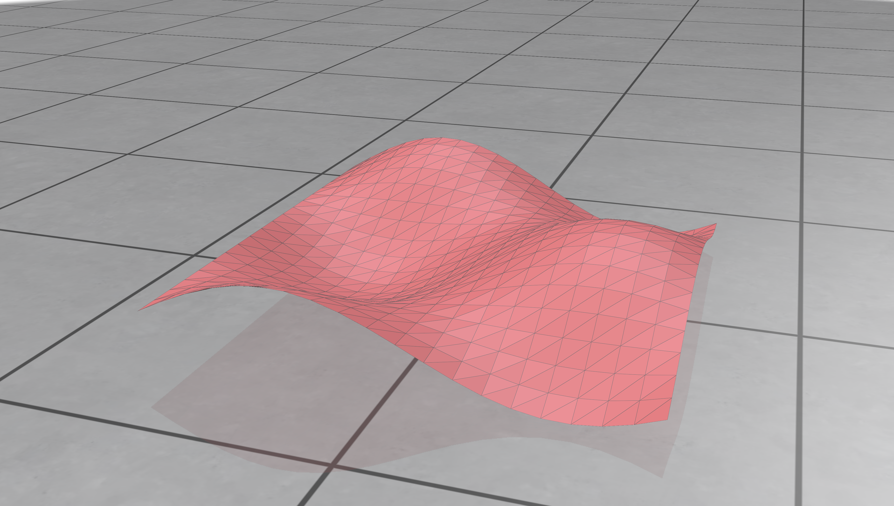
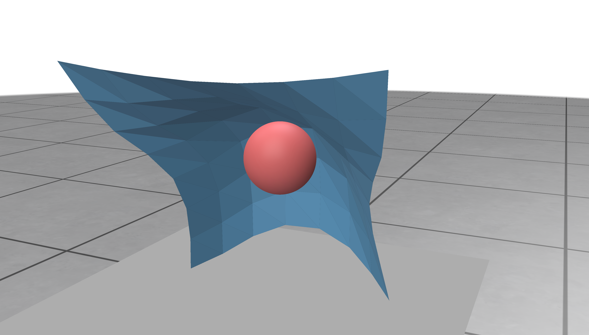

# ClothOpt

A demo for cloth simulation with intelligent control.

## System Requirements (Tested)

- **OS**: Ubuntu 24.04 LTS
- **Compiler**: GCC 11+ or Clang 14+
- **CMake**: 3.16+
- **Graphics**: OpenGL 3.3+ support

## Installation on Ubuntu 24.04

### 1. Install System Dependencies

```bash
# Update package list
sudo apt update

# Install build tools
sudo apt install build-essential cmake git

# Install graphics and windowing libraries
sudo apt install libgl1-mesa-dev libglu1-mesa-dev libglfw3-dev

# Install linear algebra library
sudo apt install libeigen3-dev

# Install Intel TBB for parallel processing
sudo apt install libtbb-dev

# Install additional dependencies
sudo apt install libx11-dev libxrandr-dev libxinerama-dev libxcursor-dev libxi-dev
```

### 2. Build

```bash
# Create build directory
mkdir build
cd build

# Configure with CMake
cmake ..

# Build the project (use -j for parallel compilation)
make -j$(nproc)

# Verify build success
ls ./bin/
```

You should see these executables:
- `Visualization` - Basic waving cloth visualization
- `Simulation` - Cloth simulation with collide
- `Optimization` - Edge pulling demo with control system

### 3. Run Examples

```bash
# Run the cloth edge pulling demo
./bin/Optimization

# Run basic simulation collide with sphere
./bin/Simulation

# Run visualization example
./bin/Visualization
```

#### Demo Screenshots

<div align="center">

**Edge Pulling Demo (`./bin/Optimization`)**

*Fundamental cloth waving animation with material properties showcase*

**Basic Visualization (`./bin/Visualization`)**

*Cloth physics simulation with sphere collision detection and realistic draping*

**Collision Simulation (`./bin/Simulation`)**

*Interactive cloth control with edge manipulation and real-time parameter adjustment*


</div>

## Project Structure

```
cloth_opt/
├── include/          
│   ├── cloth.h       # Cloth mesh and physics
│   ├── integrator.h  # Numerical integration
│   ├── controller.h  # Control system
│   └── mesh.h        # Basic mesh data structures
├── src/              
│   ├── cloth.cpp
│   ├── integrator.cpp
│   ├── controller.cpp
│   └── mesh.cpp      
├── optimization.cpp  # Main demo application
├── simulation.cpp    # Simulation
├── visual.cpp        # Basic visualization
└── CMakeLists.txt    
```

## Usage Examples

### Basic Edge Pulling Demo

The main demo (`./bin/Optimization`) showcases:

1. **10×10 cloth grid** with realistic physics
2. **Edge control system** - pull bottom edge in different directions
3. **Interactive GUI** with real-time parameter adjustment
4. **Multiple pull directions**: Forward, Backward, Left, Right, Up

**Controls:**
- Select pull direction with radio buttons
- Adjust pull distance, height, and strength with sliders
- Click "Start Pulling" to apply control forces
- Use "Reset Cloth" to return to initial state

### Advanced Control Features

The control system (`controller.h/cpp`) provides:

```cpp
// Position control - move vertices to target positions
controller.addPositionControl(vertexIndex, targetPosition, gain, maxForce);

// Velocity control - set target velocities  
controller.addVelocityControl(vertexIndex, targetVelocity, gain, maxForce);

// Force control - apply external forces
controller.addForceControl(vertexIndex, force);

// Trajectory following - animated paths
controller.setTrajectory(vertexIndex, waypoints, times, loop);

// Motion patterns - circular and sinusoidal motion
controller.addCircularMotion(vertexIndex, center, radius, frequency);
controller.addSinusoidalMotion(vertexIndex, center, amplitude, frequency);
```

## Physics Configuration

### Cloth Properties
```cpp
cloth.properties.stiffness = 800.0;         // Spring stiffness
cloth.properties.bendingStiffness = 20.0;   // Bending resistance  
cloth.properties.damping = 0.9;             // Energy dissipation
cloth.properties.friction = 0.8;            // Surface friction
cloth.properties.gravity = Eigen::Vector3d(0, -9.81, 0);
```

### Performance Optimization
- **Parallel processing** with Intel TBB
- **Optimized collision detection** for real-time performance
- **Adaptive time stepping** for stability
- **Memory-efficient** data structures

## API Reference

### ClothMesh Class

```cpp
// Create cloth grid
cloth.createGrid(width, height, spacing);

// Set properties
cloth.properties.stiffness = 1000.0;
cloth.properties.damping = 0.9;

// Pin vertices
cloth.pinVertex(vertexIndex);

// Add collision objects
cloth.addSphere(center, radius);

// Access vertices
Eigen::Vector3d pos = cloth.getVertex(index).position;
cloth.setVertexPosition(index, newPosition);
```

### ClothController Class

```cpp
// Position control
controller.addPositionControl(vertexIndex, target, gain, maxForce);
controller.updatePositionTarget(vertexIndex, newTarget);

// Force control
controller.addForceControl(vertexIndex, force);
controller.updateForceTarget(vertexIndex, newForce);

// Apply controls in simulation loop
controller.applyControls(cloth, dt);

// Utility functions
bool isControlled = controller.isControlled(vertexIndex);
auto vertices = controller.getControlledVertices();
controller.removeControl(vertexIndex);
```

### Integrator Class

```cpp
// Create and configure integrator
auto integrator = std::make_unique<SemiImplicitEulerIntegrator>();
integrator->enableDebug(true);
integrator->setDebugFrequency(30);

// Simulation step
integrator->step(cloth, dt);
```

## TODO Guide

### Future Development Tasks

#### 1. Enhanced Collision Detection System

**Objective**: Improve collision detection performance and support mesh-to-mesh collisions

**Tasks**:
- Implement spatial hashing or BVH (Bounding Volume Hierarchy) for faster collision queries
- Add mesh-to-mesh collision detection algorithms (without friction consideration)
- Optimize vertex-face and edge-edge collision handling for cloth self-collision
- Integrate continuous collision detection to prevent tunneling through fast-moving objects

**Technical Requirements**:
```cpp
// Enhanced collision interface
cloth.addMeshCollision(meshVertices, meshTriangles);
cloth.enableSelfCollision(true);
cloth.setSpatialHashingResolution(gridSize);

// Performance monitoring
CollisionStats stats = cloth.getCollisionStatistics();
```

**Expected Outcome**: Real-time cloth simulation with complex collision scenarios including cloth-cloth and cloth-object interactions.


#### 2. Optimization-Based Cloth Folding Trajectories

**Objective**: Use controller optimization APIs to generate automated folding motions, we may need to improve the simulation pipeline and performance.

**Tasks**:
- **Symmetric Fold Optimization**: Develop algorithm to fold cloth in half along center line
  - Analyze cloth geometry to find optimal fold line
  - Generate smooth trajectory that brings opposite edges together
  - Minimize cloth stretching and energy during folding motion
  
- **Diagonal Fold Optimization**: Create corner-to-corner diagonal folding trajectories
  - Identify diagonal fold patterns (corner-to-opposite-corner)
  - Optimize vertex paths to achieve clean diagonal creases
  - Handle intermediate vertex positioning to avoid collisions

**Implementation Approach**:
```cpp
// Optimization-based trajectory planning
class FoldingOptimizer {
public:
    // Generate symmetric fold trajectory
    std::vector<TrajectoryPoint> optimizeSymmetricFold(
        const ClothMesh& cloth, 
        FoldDirection direction,
        double foldDuration = 5.0
    );
    
    // Generate diagonal fold trajectory  
    std::vector<TrajectoryPoint> optimizeDiagonalFold(
        const ClothMesh& cloth,
        Corner startCorner,
        Corner endCorner,
        double foldDuration = 6.0
    );
    
    // Apply optimized trajectory to controller
    void applyFoldingTrajectory(
        ClothController& controller,
        const std::vector<TrajectoryPoint>& trajectory
    );
};
```

**Optimization Criteria**:
- Minimize total energy expenditure during folding
- Achieve target fold configuration with minimal cloth distortion  
- Ensure smooth, physically plausible motion paths
- Avoid self-intersections and excessive stretching

**Success Metrics**:
- Generate visually appealing folding animations (aesthetic quality > 70%)
- Complete fold within specified time duration
- Maintain cloth structural integrity throughout motion
- Demonstrate reproducible results across different cloth sizes

**Note**: Accuracy target is exploratory research - focus on feasible trajectory generation rather than perfect fold precision.